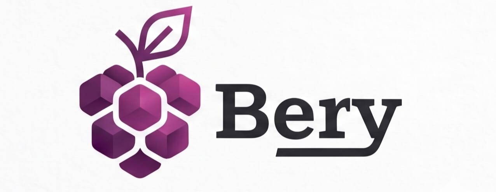

<p align="center">


</p>

<p align="center">
  
</p>
Bery is a compiled, statically typed, object-oriented programming language designed for performance and clarity. Built completely from scratch with a custom C++ frontend and an LLVM backend, Bery compiles directly to highly optimized native machine code.

This project is a **Learning Project** by team of five undergraduate engineers.

#### Sample Bery Code - 
```java
func greet(string name) -> string {
  return "Hello, " + name;
}
run {
  string msg = greet("Bery");
  println(msg);
}
```

## Proof of Our Philosophy
Bery is a learning project, that's why it is a proof of our CONCEPT CLEARANCE. The team operates under strict constraints:
1. **Zero AI Assistance**
2. **Transperancy in Communication**
3. **Strict Validation**

## State of Project
Currently, we are adding standard libraries into Bery. Every member is contributing something new for each day.

## File Extension
Bery source code files has `.bry` extension. e.g. `main.bry`, `run.bry`, etc.

## Architecture

Project pipeline follows :
1. **Lexer** : (`src/lexer/..`) It scans the source code of Bery and and tokenize it.
2. **Parser** : (`src/parer/..`) It constructs the AST (Abstract Syntax Tree) using a Top-Down recursive Descent Approach.
3. **Semantic Analyzer** : (`src/sema/..`) It traverse the whole AST for type-checking, scope resolution, implicit type casting, etc.
4. **Codegen** : (`src/codegen/..`) It translates the validated AST directly into LLVM IR via explicit hardware instructions and basic  control flow.
5. **Importer** : (`src/importer/..`) It constructs the AST for every module imported in the file, and attach it to the root node.
6. **DiagnosticEgine** : (`src/diagnostics/..`) It reports all warnings and/or errors in the file. (uses panic mode).
7. **LLVMHelper** : (`src/llvm/..`) It consists of helper functions which are used in codegen to creating `.ll` file.


## Bery Team
| Member | Role |
|---|---|
| **Vitthal Humbe** | Project Lead |
| **Yash Gajawani** | Documentation Head |
| **Pratyusha Nalavade** | Engineering |
| **Soham Nangare** | Community Head |
| **Himanshu Lodha** | Engineering |

